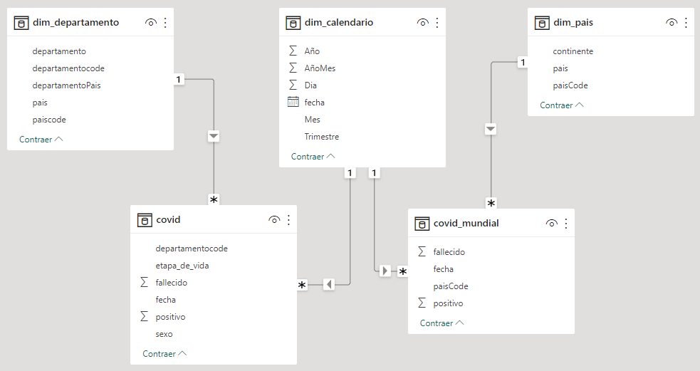

# Introduccion
Proyecto con la infraestructura de nube de Azure, comprobar la canalización de Data Factory para la entrada de datos, usar Azure Databricks para el ETL de datos y asociar Synapse con Power BI. En este caso, utilizamos datos de COVID.

# Pipeline Overview
Revise "databrics_covid_etl.ipynb", ahi tiene todo el codigo de ETL en Databricks (Pyspark), interactuando con Azure.

# Diagrama Datamart del proyecto
Se diseño dos datamart:
- Datamart con tabla hecho "covid" y con dimensiones "dim_departamento", "dim_calendario"
- Datamart con tabla hecho "covid_mundial" y con dimensiones "dim_pais", "dim_calendario"
- En la tabla hecho "covid" y "covid_mundial" ambos tiene como metrica "nro positivo" y "nro_fallecido"

# Contacto
Miguel Angel Ramos Cañari: mramos.pe@gmail.com

Celular: +51952351404

LinkedIn: https://www.linkedin.com/in/miguel-angel-ramos-canari/
